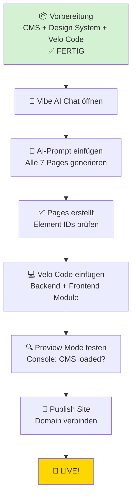

# ⚡ energievergleich.shop - Wix Vibe Implementation

**Status:** ✅ CMS Infrastructure Complete | 👉 Ready for AI-Guided Deployment

---

## 🎯 Projektübersicht

**Plattform:** Wix Vibe (AI-generierte Site)  
**Site ID:** `52dd1482-1ebb-4472-90a2-bce2af5d763f`  
**Domain:** energievergleich.shop  
**Zweck:** Vergleichsplattform für Strom, Gas & Photovoltaik in NRW

### ✅ Bereits fertig:
- **CMS Collection:** `SiteContent` mit 8 Content Items
- **Design System:** 9 Custom Embeds (CSS Variables, Components, SEO, Analytics)
- **Velo Backend:** 2 Module (Pages Router, SEO Manager)
- **Velo Frontend:** 7 Page-Codes (Home, Strom, Gas, PV, Gewerbe, Kontakt, Ratgeber)

### 👉 Nächster Schritt:
**AI-gesteuerte Page-Erstellung mit Vibe AI** (30 Minuten)

---

## 🚀 Quick Start: AI-Implementierung

### Option 1: Vollautomatisch (Empfohlen)



**⏱️ Geschätzte Zeit:** 30 Minuten

---

## 📚 Dokumentation

### 🎯 Haupt-Guides
1. **[VIBE-QUICKSTART.md](VIBE-QUICKSTART.md)** ⭐  
   → 30-Minuten-Anleitung mit Copy-Paste-Code

2. **[VIBE-AI-PROMPTS.md](VIBE-AI-PROMPTS.md)** 🤖  
   → Fertige AI-Prompts für alle 7 Pages

3. **[VIBE-IMPLEMENTATION.md](VIBE-IMPLEMENTATION.md)** 📝  
   → Detaillierte Implementierung + Troubleshooting

### 🛠️ Code-Ressourcen
- **Velo Backend:** [/velo/backend/](velo/backend/)
  - `pages-router.jsw` - CMS Content Manager
  - `seo-manager.jsw` - SEO + Structured Data

- **Velo Frontend:** [/velo/public/pages/](velo/public/pages/)
  - `home.js` - Homepage
  - `stromvergleich-nrw.js` - Stromvergleich
  - `gasvergleich-nrw.js` - Gasvergleich
  - `photovoltaik-nrw.js` - Photovoltaik
  - `gewerbestrom.js` - Gewerbestrom
  - `kontakt.js` - Kontaktformular
  - `ratgeber.js` - Ratgeber-Kategorie-Übersicht

### ⚙️ Setup-Tools
- **[velo-auto-setup.js](velo-auto-setup.js)** - Automatische Velo-Installation
- **[DEPLOYMENT-GUIDE.md](DEPLOYMENT-GUIDE.md)** - Deployment Checkliste

---

## 🏛️ Architektur

### Content Management
```
Wix CMS (SiteContent Collection)
    │
    ├── global          (Navigation, Footer)
    ├── home            (Homepage Content)
    ├── stromvergleich  (Stromvergleich NRW)
    ├── gasvergleich    (Gasvergleich NRW)
    ├── photovoltaik    (Photovoltaik NRW)
    ├── gewerbestrom    (Gewerbestrom)
    ├── kontakt         (Kontaktseite)
    └── ratgeber        (Ratgeber-Übersicht)
```

### Design System
```
Custom Embeds (HEAD)
    │
    ├── Design Tokens (CSS Variables)
    ├── Button Components
    ├── Form Components
    ├── SEO Meta Tags Helper
    ├── Schema.org Structured Data
    ├── Cookie-Banner (DSGVO)
    ├── CMS Content Helper
    └── Analytics Helper
```

### Velo Code Flow
```
Page Load
    │
    ├── Frontend (public/pages/*.js)
    │   │
    │   ├── setSEO(pageKey)              [backend/seo-manager.jsw]
    │   │   └── Set Title, Description, Structured Data
    │   │
    │   ├── getPageContent(pageKey)      [backend/pages-router.jsw]
    │   │   ├── Check Cache
    │   │   └── Query CMS (wixData)
    │   │
    │   └── Render Content to Elements (#heroTitle, #faqRepeater, etc.)
    │
    └── Console: ✅ CMS loaded, ✅ SEO set
```

---

## 📝 3-Schritte-Anleitung

### Schritt 1: Vibe Dashboard öffnen
```bash
https://manage.wix.com/dashboard/52dd1482-1ebb-4472-90a2-bce2af5d763f
```

### Schritt 2: Vibe AI Pages erstellen
1. **Vibe AI Chat öffnen** (Icon unten rechts)
2. **Prompt kopieren** aus [VIBE-AI-PROMPTS.md](VIBE-AI-PROMPTS.md)
3. **Pages generieren lassen** (7 Pages auf einmal)
4. **Element IDs prüfen** (Properties Panel)

### Schritt 3: Velo Code einfügen
1. **Dev Mode aktivieren** (Toolbar → Dev Mode)
2. **Backend-Module:** Kopiere aus [/velo/backend/](velo/backend/)
   - `pages-router.jsw`
   - `seo-manager.jsw`
3. **Frontend-Code:** Für jede Page aus [/velo/public/pages/](velo/public/pages/) kopieren
4. **Testen:** Preview Mode → Console prüfen
5. **Publishen:** Domain verbinden + Veröffentlichen

---

## ✅ Checkliste

### Phase 1: Vorbereitung (✅ FERTIG)
- [x] CMS Collection `SiteContent` erstellt
- [x] 8 Content Items eingefügt
- [x] Design System (9 Custom Embeds)
- [x] Velo Backend-Code bereit
- [x] Velo Frontend-Code bereit

### Phase 2: AI-Generierung (👉 JETZT)
- [ ] Vibe AI Chat öffnen
- [ ] AI-Prompt senden
- [ ] 7 Pages generiert
- [ ] Element IDs verifiziert

### Phase 3: Code-Integration
- [ ] Velo Dev Mode aktiv
- [ ] Backend-Module eingefügt
- [ ] Page-Codes eingefügt
- [ ] Preview Mode getestet

### Phase 4: Publishing
- [ ] Alle Pages funktional
- [ ] Domain verbunden (energievergleich.shop)
- [ ] Site veröffentlicht
- [ ] 🎉 **LIVE!**

---

## 🐛 Troubleshooting

### CMS Content wird nicht geladen?
**→ Collection Permissions prüfen:**
```
Dashboard → CMS → SiteContent → Permissions
→ "Site members (read)"
```

### Element IDs fehlen?
**→ Manuell setzen:**
```
1. Element auswählen
2. Properties Panel (rechts)
3. Advanced → ID Settings
4. ID einfügen (ohne #)
```

### Vibe AI ignoriert Prompts?
**→ Single-Page-Prompts verwenden:**
```
Anstatt alle 7 Pages auf einmal:
Erstelle jede Page einzeln (Prompt 2 in VIBE-AI-PROMPTS.md)
```

### Console Errors?
**→ CMS Query testen:**
```javascript
// In Browser Console:
await wixData.query('SiteContent').eq('contentKey', 'home').find();
```

---

## 📞 Support

- **Wix Vibe Docs:** https://support.wix.com/en/article/wix-vibe-an-overview
- **Velo Docs:** https://dev.wix.com/docs/velo
- **GitHub Issues:** https://github.com/cherinodiaz-lang/energievergleichnrw/issues

---

## 📊 Tech Stack

| Layer | Technology |
|-------|------------|
| Platform | Wix Vibe (AI-generated) |
| CMS | Wix Data (SiteContent Collection) |
| Backend | Velo (JavaScript) |
| Frontend | Velo + Wix Elements |
| Design | Custom CSS (Design Tokens) |
| SEO | wix-seo-frontend + Schema.org |
| Analytics | Cookie-Consent + Analytics Helper |

---

## 📅 Timeline

- **04.03.2026, 14:00** - CMS Infrastructure Setup
- **04.03.2026, 16:00** - Design System Complete
- **04.03.2026, 18:00** - Velo Code Complete
- **04.03.2026, 18:30** - 👉 **AI-Guided Deployment Ready**
- **TBD** - Site Live

---

**🎉 Bereit für AI-Implementierung!**  
Folge [VIBE-QUICKSTART.md](VIBE-QUICKSTART.md) für die nächsten Schritte.

**Last Updated:** 04.03.2026, 18:25 CET
